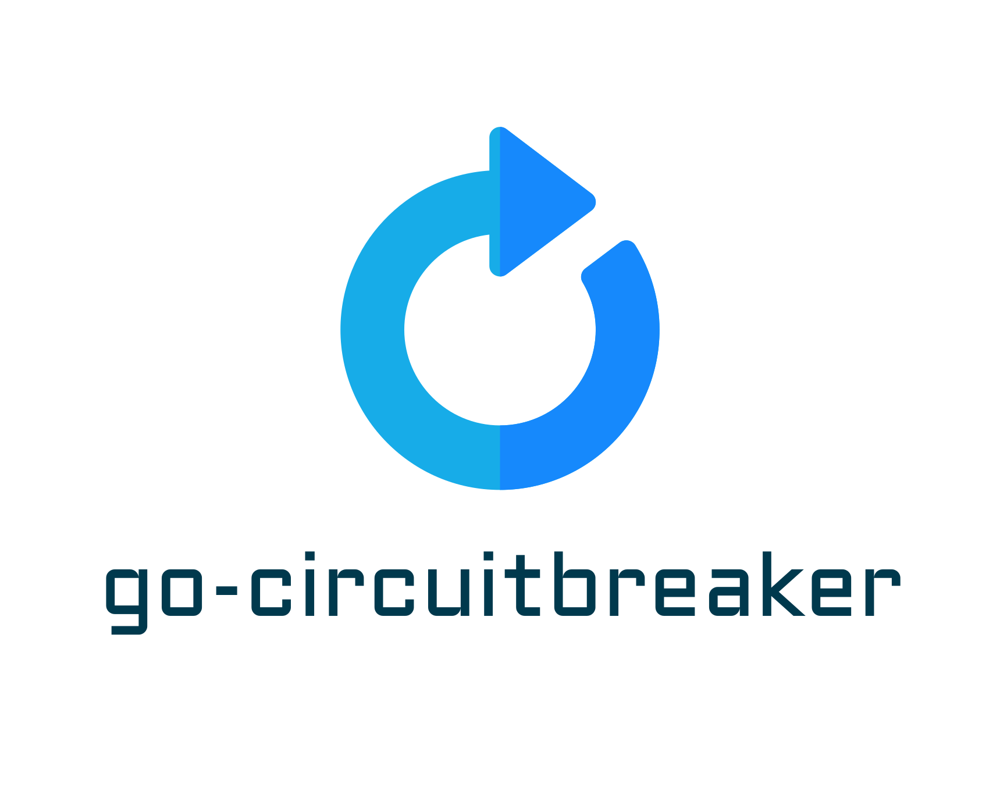

# go-circuitbreaker

<!-- PROJECT LOGO -->
<br />
<p align="center">
  <a href="https://github.com/kecci/go-circuitbreaker">
    
  </a>

  <h3 align="center">go-circuitbreaker</h3>

  <p align="center">
    An awesome README template to jumpstart your projects!
    <br />
    <a href="https://github.com/kecci/go-circuitbreaker"><strong>Explore the docs »</strong></a>
    <br />
    <br />
    <a href="https://github.com/kecci/go-circuitbreaker">View Demo</a>
    ·
    <a href="https://github.com/kecci/go-circuitbreaker/issues">Report Bug</a>
    ·
    <a href="https://github.com/kecci/go-circuitbreaker/issues">Request Feature</a>
  </p>
</p>


<!-- TABLE OF CONTENTS -->
<details open="open">
  <summary>Table of Contents</summary>
  <ol>
    <li>
      <a href="#about-the-project">About The Project</a>
      <ul>
        <li><a href="#built-with">Built With</a></li>
      </ul>
    </li>
    <li>
      <a href="#getting-started">Getting Started</a>
      <ul>
        <li><a href="#prerequisites">Prerequisites</a></li>
        <li><a href="#installation">Installation</a></li>
      </ul>
    </li>
    <li><a href="#usage">Usage</a></li>
    <li><a href="#roadmap">Roadmap</a></li>
    <li><a href="#contributing">Contributing</a></li>
    <li><a href="#license">License</a></li>
    <li><a href="#contact">Contact</a></li>
    <li><a href="#acknowledgements">Acknowledgements</a></li>
  </ol>
</details>


<!-- ABOUT THE PROJECT -->
## About The Project

Simple circuit breaker with go

### Built With

We decided to use solid language and library:
* [golang](https://golang.org/)
* [hystrix-go](github.com/afex/hystrix-go/hystrix)
* [go-resiliency](github.com/eapache/go-resiliency/retrier)


<!-- GETTING STARTED -->
## Getting Started

To start this project with yout golang project, you need to install this package first

### Prerequisites

This is an example of how to list things you need to use the software and how to install them.
* go mod
  ```sh
  go get github.com/kecci/go-circuitbreaker
  ```

### Installation

1. Get a free API Key at [https://example.com](https://example.com)
2. Go get the repo
   ```sh
   go get github.com/kecci/go-circuitbreaker
   ```

<!-- USAGE EXAMPLES -->
## Usage

```go
package main

import github.com/kecci/go-circuitbreaker

func main() {  
  // SET BASE URL
  baseURL, err := url.Parse("http://google.com")

  // SET HTTP REQUEST
  req, err := http.NewRequest(http.MethodPost, baseURL.String(), bytes.NewBuffer(param))
	req.Header.Set("Api-Key", "secret")
	req.Header.Set("Content-Type", "application/json")

  // SET BODY
  request := ParamRequest{}
  requestBody := new(bytes.Buffer)
	_ = json.NewEncoder(requestBody).Encode(request)

  // SET CIRCUIT BREAKER
  cb := circuitbreaker.New()
  res, err := cb.CallUsingCircuitBreaker("breaker-name", req, requestBody)
}
```

<!-- ROADMAP -->
## Roadmap
See the [open issues](https://github.com/kecci/go-circuitbreaker/issues) for a list of proposed features (and known issues).

<!-- LICENSE -->
## License
Distributed under the MIT License. See `LICENSE` for more information.